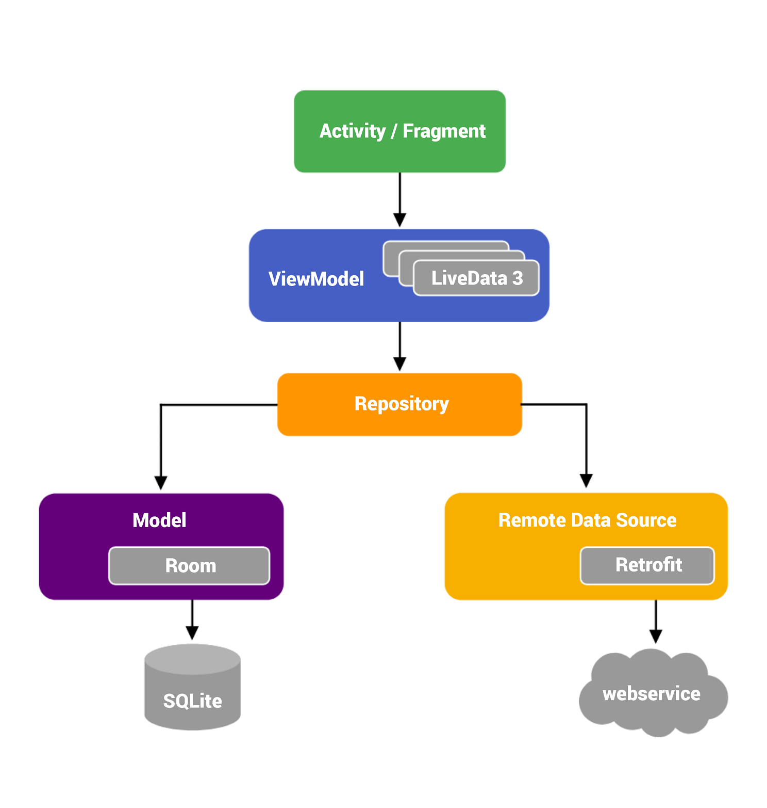

# GithubAppMVVM
 [](http://developer.android.com/index.html) [](http://kotlinlang.org) [](https://developer.android.com/studio/releases/gradle-plugin)

## App Feature
- Search User On Github
- Add Favorite User
- Delete Favorite User
- User Favorite
- Reminder At 9:00 AM
- Localization
- Content Provider 
## ConsumerApp Feature
- Subsribe Favorite User From Main App
## MVVM Architecture 
<p align="left">
    
</p>
Android Architecture Components (MVVM) is one of the patterns released by Google. This collection of libraries helps you to design robust, testable and easily manageable       applications. The image above, is a big picture of Architecture Components. Each component has its own function. If broken down into components:

- View: It can be said as a UI controller or Fragment and Activity that serves to display data or perform actions in the UI.
- ViewModel: Provides data to the UI. Acts as a communication center between the Repository and the UI. The ViewModel function retains data from configuration changes.
- LiveData: Observable data holder class. Always holds/save latest version data. Notifies the observers when the data has changed. The UI component only observes or observes      relevant data and will not stop or continue to observe.
- Repository: You use the Repository to manage multiple data sources, such as network, local or cache origin.
- Room: Source of data from local database. Room is a library that provides an abstraction layer over SQLite to enable more robust database access by leveraging the power of SQLite.
- Rest Client: Data source originating from the network, such as Rest API, Firebase or other client data. 


## Built With
- [Kotlin](https://kotlinlang.org/) - First class and official programming language for Android development.
- [Coroutines](https://kotlinlang.org/docs/reference/coroutines-overview.html) - Is light wight threads for asynchronous programming
- [Android Architecture Components](https://developer.android.com/topic/libraries/architecture) - Collection of libraries that help you design robust, testable, and maintainable apps.
   - [LiveData](https://developer.android.com/topic/libraries/architecture/livedata) - Data objects that notify views when the underlying database changes.
   - [ViewModel](https://developer.android.com/topic/libraries/architecture/viewmodel) - Stores UI-related data that isn't destroyed on UI changes.
   - [ViewBinding](https://developer.android.com/topic/libraries/view-binding) - Generates a binding class for each XML layout file present in that module and allows you to more easily write code that interacts with views.
   - [Room](https://developer.android.com/topic/libraries/architecture/room) - SQLite object mapping library.
- [Service Locator](https://developer.android.com/training/dependency-injection) - Alternative dependency injection,  dependency injection is a technique whereby one object (or static method) supplies the dependencies of another object. A dependency is an object that can be used (a service).
- [Hilt-android](https://dagger.dev/hilt/) Hilt provides a standard way to incorporate Dagger dependency injection into an Android application.
- [Dagger2](https://dagger.dev/dev-guide/) Dagger is a fully static, compile-time dependency injection framework for both Java and Android (If you want to see this project using dagger, you can go to [this branch](https://github.com/Aditprayogo/GithubUsers/tree/old-dagger))
- [Retrofit](https://square.github.io/retrofit/) - A type-safe HTTP client for Android and Java.
- [OkHttp](http://square.github.io/okhttp/) An HTTP & HTTP/2 client for Android and Java applications.
- [Gson](https://github.com/google/gson) A Java serialization/deserialization library to convert Java Objects into JSON and back
- [Glide](https://github.com/bumptech/glide) An image loading and caching library for Android focused on smooth scrolling
- [Material Design](https://material.io/develop/android/docs/getting-started) Material is a design system created by Google to help teams build high-quality digital experiences for Android, iOS, Flutter, and the web.
- [Encryption with SQLCipher](https://github.com/sqlcipher/android-database-sqlcipher)
- Obfuscation with Proguard
- Certificate Pinning with OkHttp

# License
```

   Copyright ©faridrama123

   Licensed under the Apache License, Version 2.0 (the "License");
   you may not use this file except in compliance with the License.
   You may obtain a copy of the License at

       http://www.apache.org/licenses/LICENSE-2.0

   Unless required by applicable law or agreed to in writing, software
   distributed under the License is distributed on an "AS IS" BASIS,
   WITHOUT WARRANTIES OR CONDITIONS OF ANY KIND, either express or implied.
   See the License for the specific language governing permissions and
   limitations under the License.

```
